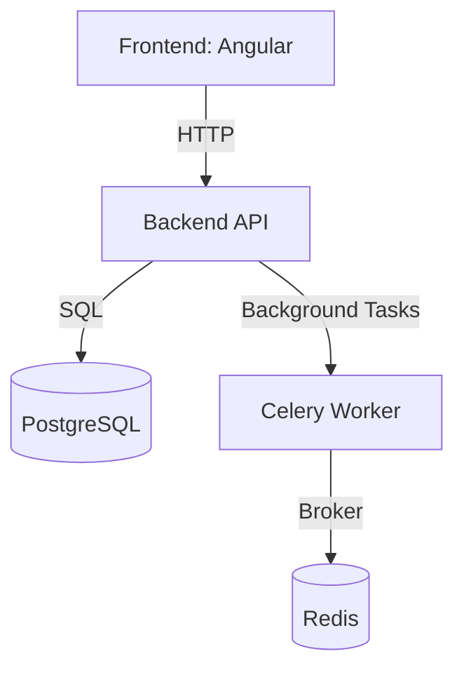

# 🚀 Full-Stack interactive workflow Vulnerability Manager

[](#)
[](#)
[](#)
[](#)

A full-stack application for scanning and reviewing SBOMs and container vulnerabilities.

---

## 🗂️ Project Structure

```
project-root/
├── backend/                  # FastAPI backend
│   ├── app/
│   │   ├── models/           # SQLAlchemy models
│   │   ├── routes/           # API endpoints
│   │   ├── utils/            # Trivy, helpers
│   │   ├── auth.py           # JWT auth
│   │   ├── celery_worker.py  # Celery task entry
│   │   └── main.py
│   ├── requirements.txt      # Pip dependencies
│   └── Dockerfile
│
├── frontend/                 # Angular frontend
│   ├── src/app/              # Components, services
│   ├── angular.json
│   └── Dockerfile
│
├── docker-compose.yml        # Full dev stack
├── nginx.conf                # Secure NGINX config
└── README.md                 # You're here!
```

---

## ⚙️ Tech Stack

| Layer       | Technology         |
|-------------|--------------------|
| Frontend    | Angular (latest)   |
| Backend     | FastAPI            |
| Auth        | JWT + Role-based   |
| Database    | PostgreSQL         |
| Cache/Queue | Redis + Celery     |
| Scanning    | Trivy              |
| Deployment  | Docker + NGINX     |

---

## 📦 Environment Variables

Create a `.env` file in the `backend/` folder:

```env
DATABASE_URL=postgresql+asyncpg://postgres:postgres@db:5432/appdb
REDIS_URL=redis://redis:6379/0
SECRET_KEY=super-secret-key
```

---

## 📸 Architecture



---

## 🚀 Quick Start (Dev)

### 1. Clone the Repo

```bash
git clone https://github.com/your-org/your-repo.git
cd your-repo
```

### 2. Build and Launch All
```bash
docker-compose up --build
```

🕓 Generated on 2025-07-27T17:45:07.926596 UTC
